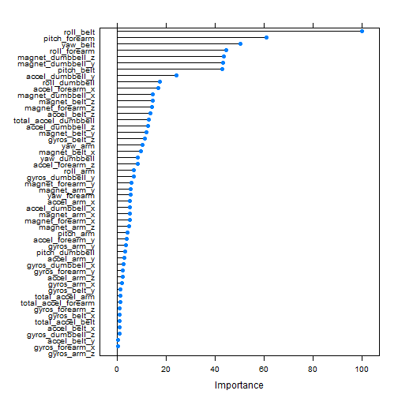
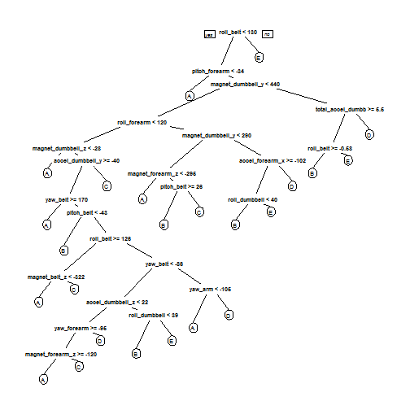

# Machine Learning - Course Project
# Sensor Belt Project to determine how good a training is

# Executive Summary
Jawbone Up, Nike FuelBand, and Fitbit divices help a group of enthusiasts who take measurements about themselves regularly to improve their health,to find patterns in their behavior. One thing that people regularly do is quantify how much of a particular activity they do, but they rarely quantify how well they do it. In this project, your goal will be to use data from accelerometers on the belt, forearm, arm, and dumbell of 6 participants. They were asked to perform barbell lifts correctly and incorrectly in 5 different ways.
 More information is available from the website here: http://groupware.les.inf.puc-rio.br/har (see the section on the Weight Lifting Exercise Dataset). 
 
Scope : The goal of your project is to predict the manner in which they did the exercise. This is the "classe" variable in the training set. You may use any of the other variables to predict with.

Approach:
- Split the data into training test sets
- Build a model on the training set
- Evaluate on the test set
- Predict the values
- check model performance

Results:
The accuracy of the random forest model is 99%. The model is valid and considered to predict well for the given problem.
End Results
[1] B A B A A E D B A A B C B A E E A B B B
Levels: A B C D E


```r
setwd("C:/DATA/DATA_SCIENCE/08_MACHINE/DATA_MLE")
## Step 1:load packages
#install.packages("doParallel")
#install.packages("caret")
#install.packages("rpart")
#install.packages("rpart.plot")
#install.packages("randomForest")
#install.packages("corrplot")
suppressMessages(library(doParallel, verbose=FALSE))
registerDoParallel(cores=2)
suppressMessages(library(caret, verbose=FALSE))
suppressMessages(library(rpart, verbose=FALSE))
suppressMessages(library(rpart.plot, verbose=FALSE))
suppressMessages(library(randomForest,verbose=FALSE))
```


```r
##Step 2: download data
#download.file('https://d396qusza40orc.cloudfront.net/predmachlearn/pml-training.csv', 'pml-training.csv')
#download.file('https://d396qusza40orc.cloudfront.net/predmachlearn/pml-testing.csv','pml-test.csv' )

##Step 3: read data

train <- read.csv("pml-training.csv")
test <- read.csv("pml-testing.csv")
table(train$classe)
```

```
## 
##    A    B    C    D    E 
## 5580 3797 3422 3216 3607
```


```r
##Step 4: prepare the data

classe <- train$classe
train<-train[, colSums(is.na(train)) == 0] 
train_no <- grepl("^X|timestamp|window", names(train))
train <- train[, !train_no]
# just in case transform to numeric
train_touse <- train[, sapply(train, is.numeric)]
train_touse$classe <- classe


test <- test[, colSums(is.na(test)) == 0] 
test_no <- grepl("^X|timestamp|window", names(test))
test <- test[, !test_no]
test_touse <- test[, sapply(test, is.numeric)]
```
From the 160 variables from the train set, the ones containing NAs are not going to be used. The Window expressed in microseconds is also not going to be used. The others variables can be used for prediction.


```r
##Step 5: slice the data
set.seed(10000) # to reproduce the results again
inTrain <- createDataPartition(train_touse$classe, p=0.60, list=F)
trainData <- train_touse[inTrain, ]
testData <- train_touse[-inTrain, ]
```
From the training set 60% will be used for training the model and 40% will be used for testing.


```r
##Step 6: model the sets
controlRf <- trainControl(method="cv", 5)
modelRf <- train(classe ~ ., data=trainData, method="rf", trControl=controlRf, ntree=200)
modelRf
```

```
## Random Forest 
## 
## 11776 samples
##    52 predictor
##     5 classes: 'A', 'B', 'C', 'D', 'E' 
## 
## No pre-processing
## Resampling: Cross-Validated (5 fold) 
## 
## Summary of sample sizes: 9420, 9420, 9421, 9420, 9423 
## 
## Resampling results across tuning parameters:
## 
##   mtry  Accuracy   Kappa      Accuracy SD  Kappa SD   
##    2    0.9885370  0.9854960  0.003757804  0.004756176
##   27    0.9895552  0.9867868  0.002374415  0.003004025
##   52    0.9818269  0.9770072  0.003573204  0.004520893
## 
## Accuracy was used to select the optimal model using  the largest value.
## The final value used for the model was mtry = 27.
```

```r
#importance(modelRf)
#getTree(modelRf$finalModel,k=5)
```
The random forest algorith is going to be used for the modeling. Random Forest algorithm are know for their accuracy. In this case the number of tress was chosen 200 to speed up calculations.


```r
plot(varImp(modelRf))
```

 

# Model Accuracy

```r
predictRf <- predict(modelRf, testData)
confusionMatrix(testData$classe, predictRf)
```

```
## Confusion Matrix and Statistics
## 
##           Reference
## Prediction    A    B    C    D    E
##          A 2229    2    0    0    1
##          B   15 1498    5    0    0
##          C    0   19 1343    6    0
##          D    0    0   15 1270    1
##          E    0    1    3    8 1430
## 
## Overall Statistics
##                                           
##                Accuracy : 0.9903          
##                  95% CI : (0.9879, 0.9924)
##     No Information Rate : 0.286           
##     P-Value [Acc > NIR] : < 2.2e-16       
##                                           
##                   Kappa : 0.9877          
##  Mcnemar's Test P-Value : NA              
## 
## Statistics by Class:
## 
##                      Class: A Class: B Class: C Class: D Class: E
## Sensitivity            0.9933   0.9855   0.9832   0.9891   0.9986
## Specificity            0.9995   0.9968   0.9961   0.9976   0.9981
## Pos Pred Value         0.9987   0.9868   0.9817   0.9876   0.9917
## Neg Pred Value         0.9973   0.9965   0.9964   0.9979   0.9997
## Prevalence             0.2860   0.1937   0.1741   0.1637   0.1825
## Detection Rate         0.2841   0.1909   0.1712   0.1619   0.1823
## Detection Prevalence   0.2845   0.1935   0.1744   0.1639   0.1838
## Balanced Accuracy      0.9964   0.9912   0.9897   0.9933   0.9984
```

```r
accuracy <- postResample(predictRf, testData$classe)
accuracy
```

```
##  Accuracy     Kappa 
## 0.9903135 0.9877454
```

The accuracy of the random forest model is 99%. The model is valid and considered to predict well for the given problem.

# Exploratory analysis

Final results and the trees analysis


```r
treeModel <- rpart(classe ~ ., data=trainData, method="class")
prp(treeModel) # fast plot
```

 


